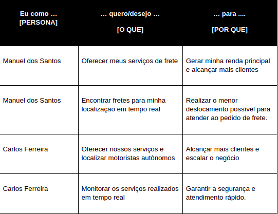
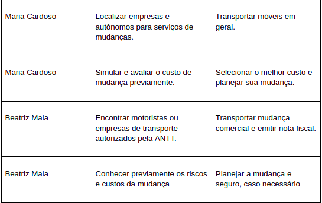
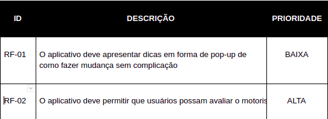
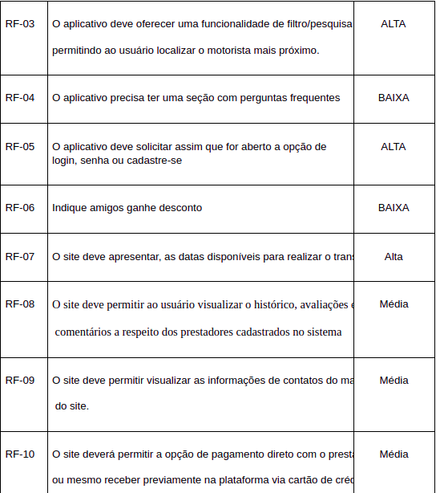

# Especificações do Projeto

A definição exata do problema e os pontos mais relevantes a serem tratados neste projeto foram consolidados com a participação dos membros da equipe a partir da observação e utilização de serviços ou aplicativos de transporte de cargas.

Destacamos os websites www.getninjas.com.br e www.mudamuda.com.br, assim como os aplicativos TruckPad e Fretebras.

As pessoas que sofreram e temem sofrem com a falta de um serviço qualificado, que as atenda nesse momento que muito das vezes é delicado para sua grande maioria, nem sempre a mudança simboliza um bom momento e por isso é preciso ter um serviço eficaz e prático para todos.
As necessidades deste projeto se traduzem nas personas apresentadas abaixo, onde poderemos observar com mais clareza seus pontos e suas dores a respeito da falta deste serviço.

## Personas

As personas levantadas durante o processo de entendimento do problema são apresentadas na Figuras que se seguem.

As personas levantadas durante o processo de entendimento do problema são apresentadas na Figuras que se seguem.

<table border="1">
    <tr>
        <td>Nome</td>
        <td>Idade</td>
        <td>Profissão</td>
        <td>Aplicativos</td>
        <td>Motivações</td>
        <td>Frustrações</td>
        <td>Hobbies, História</td>
    </tr>
    <tr>
        <td>Maria Cardoso/td>
        <td>25 anos</td>
        <td> Estudante de medicina.
</td>
        <td>Linkedin
        Facebook
        Instagram
        Aplicativos bancários
        </td>
        <td>Profissão 
          Qualidade de vida
          Salvar vidas
         
        Burocracia
        Condições de estudo
        Infraestrutura urbana
        Violência
        </td>
        <td>Concorrência
        Custo de vida
        Aposentadoria
        </td>
        <td>Viajar
        Estudar
        </td>
    </tr>
</table>
<table border="1">
    <tr>
        <td>Nome</td>
        <td>Idade</td>
        <td>Profissão</td>
        <td>Aplicativos</td>
        <td>Motivações</td>
        <td>Frustrações</td>
        <td>Hobbies, História</td>
    </tr>
    <tr>
        <td>Manuel dos Santos</td>
        <td>60 anos</td>
        <td>Motorista profissional para transporte de cargas e de passageiros. Mais de 30 anos de experiência.
</td>
        <td>Linkedin</td>
        <td>Família  
        Qualidade de vida
        </td>
        <td>Concorrência
        Custo de vida
        Aposentadoria
        </td>
        <td>Viajar
        Pescar
        </td>
    </tr>
</table>

> Lembre-se que você deve ser enumerar e descrever precisamente e personalizada todos os clientes ideais que sua solução almeja.

## Histórias de Usuários

A partir da compreensão do dia a dia das personas identificadas para o projeto, foram registradas as seguintes histórias de usuários.

> **Links Úteis**:
>
> - [Histórias de usuários com exemplos e template](https://www.atlassian.com/br/agile/project-management/user-stories)
> - [Como escrever boas histórias de usuário (User Stories)](https://medium.com/vertice/como-escrever-boas-users-stories-hist%C3%B3rias-de-usu%C3%A1rios-b29c75043fac)
> - [User Stories: requisitos que humanos entendem](https://www.luiztools.com.br/post/user-stories-descricao-de-requisitos-que-humanos-entendem/)
> - [Histórias de Usuários: mais exemplos](https://www.reqview.com/doc/user-stories-example.html)
> - [9 Common User Story Mistakes](https://airfocus.com/blog/user-story-mistakes/)

## Requisitos

As tabelas que se seguem apresentam os requisitos funcionais e não funcionais que detalham o escopo do projeto.

### Requisitos Funcionais

A tabela a seguir apresenta os requisitos funcionais que o projeto deverá atender.

### Requisitos não Funcionais

| ID      | Descrição do Requisito                                            | Prioridade |
| ------- | ----------------------------------------------------------------- | ---------- |
| RNF-001 | O sistema deve ser responsivo para rodar em um dispositivos móvel | MÉDIA      |
| RNF-002 | Deve processar requisições do usuário em no máximo 3s             | BAIXA      |

Com base nas Histórias de Usuário, enumere os requisitos da sua solução. Classifique esses requisitos em dois grupos:

- [Requisitos Funcionais
  (RF)](https://pt.wikipedia.org/wiki/Requisito_funcional):
  correspondem a uma funcionalidade que deve estar presente na
  plataforma (ex: cadastro de usuário).
- [Requisitos Não Funcionais
  (RNF)](https://pt.wikipedia.org/wiki/Requisito_n%C3%A3o_funcional):
  correspondem a uma característica técnica, seja de usabilidade,
  desempenho, confiabilidade, segurança ou outro (ex: suporte a
  dispositivos iOS e Android).
  Lembre-se que cada requisito deve corresponder à uma e somente uma
  característica alvo da sua solução. Além disso, certifique-se de que
  todos os aspectos capturados nas Histórias de Usuário foram cobertos.

## Restrições

As questões que limitam a execução desse projeto e que se configuram como obrigações claras para o desenvolvimento do projeto em questão são apresentadas na tabela a seguir.

| ID  | Restrição                                             |
| --- | ----------------------------------------------------- |
| 01  | O projeto deverá ser entregue até o final do semestre |
| 02  | Não pode ser desenvolvido um módulo de backend        |

Enumere as restrições à sua solução. Lembre-se de que as restrições geralmente limitam a solução candidata.

## Referências:
https://resultadosdigitais.com.br/blog/persona-o-que-e/
