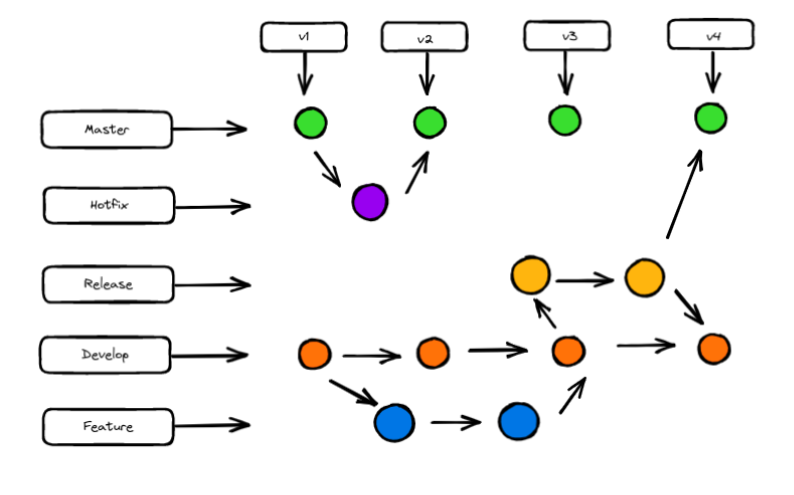

# Metodologia

Pré-requisitos: <a href="2-Especificação do Projeto.md"> Documentação de Especificação</a>

As metodologias utilizadas pela equipe baseiam-se em reuniões semanais para alinhar o andamento do projeto a fim de entender as necessidades específicas de cada etapa. Contamos com a utilização do Trello para nos auxiliar conforme a demanda, é nele que anotamos o Backlog e o andamento das ToDo 's. 
O github tem sido a base para a entrega geral das etapas, é nele que controlamos as entregas de cada etapa. No Figma consta toda nossa interface, o caminho que o usuário utiliza para navegar pelas páginas, o design desenvolvido e o entendimento do que precisa ser  desenvolvido para uma aplicação real.

<table>  
<tr>
  <th> Ambiente  </th> 
  <th> Plataforma </th>
  <th> Link Acesso </th>
</tr>
<tr>
   <td> Repostirorio Código Fonte </td>
   <td> GitHub </td>
   <td>  https://github.com/ICEI-PUC-Minas-PMV-ADS/pmv-ads-2021-2-e1-proj-web-t6-ads_2021_02_e1_grupo_3 </td>
</tr>
<tr>
   <td> Documentos do Projeto </td>
    <td> Google Drive </td>   
    <td> https://drive.google.com/drive/u/0/folders/1mOpXH7p_F-6VE_QBosoUq56AgVPpfjWr </td>
</tr>
<tr>
    <td> Projeto de Interface Wareframes </td>
    <td> Figma </td>
    <td> https://www.figma.com/file/AV5VT1GJXRw0oXk2Dijjq5/MudE---PROJETO-PUC-MINAS?node-id=0%3A1 </td>
</tr>
<tr>
    <td> Gerenciamento do Projeto  </td>
    <td> Trello </td>
    <td> https://trello.com/b/YCKOJ0Gl/projeto-puc-minas </td>
</tr>
</table>

## Gestão de Código fonte

A gestão de código fonte tem como base os exemplos dados no modelo de projeto disponibilizado pela PUC Minas. 
A cada etapa do projeto é feito uma versão, mostrada no gráfico abaixo como v1, v2, v3 e v4 com relação a master. O Hotfix cuidará das atualizações do programa, sendo necessário usar apenas uma vez. A Release tem como objetivo relatar o que foi feito durante todo o projeto, para poder documentar  de forma técnica. Os Develops serão separados por grupo para com relação às etapas com relação ao grau de dificuldade. Com as Features podemos voltar para rever as novas reais necessidade após a implementação.  

