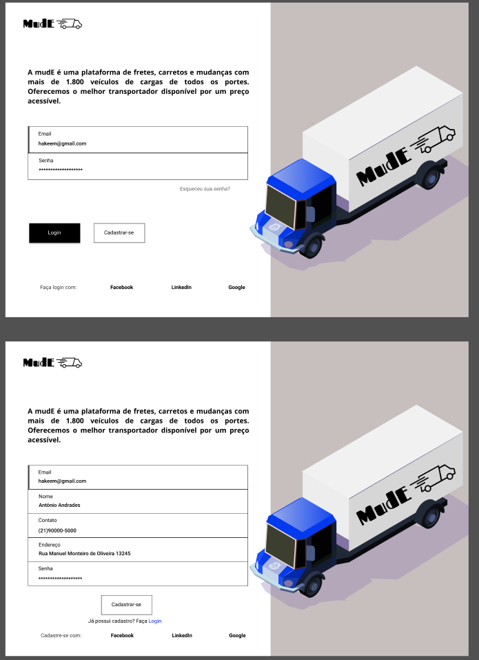
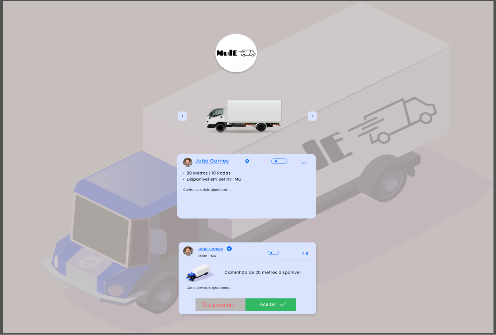
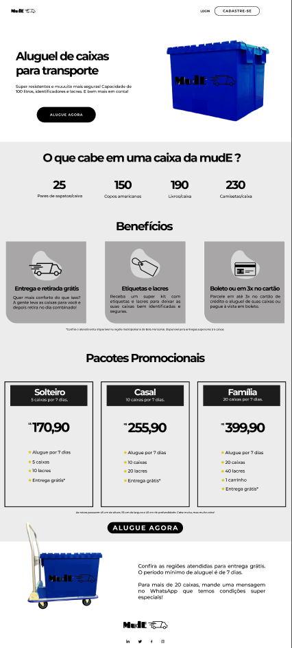
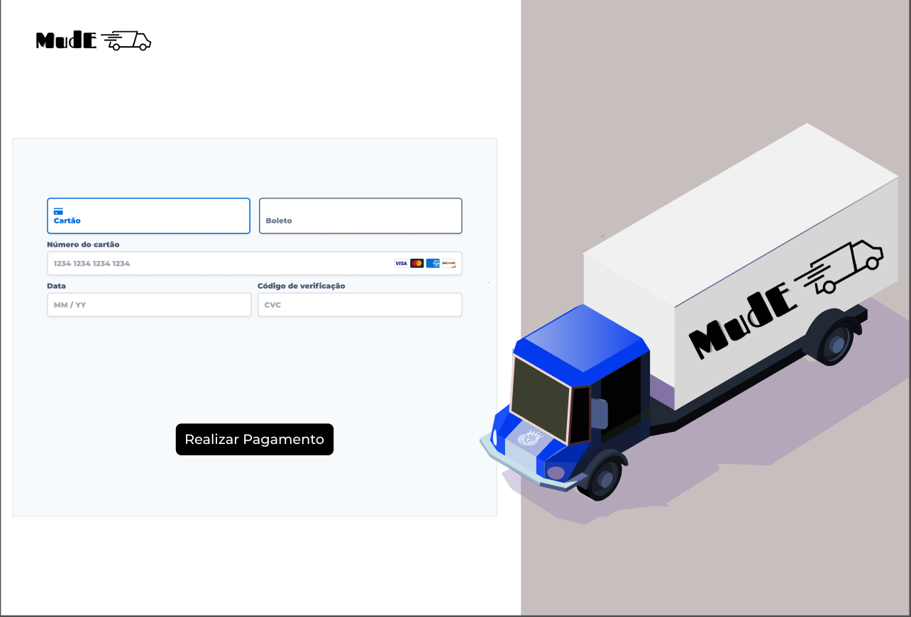

# Programação de Funcionalidades

Pré-requisitos: <a href="2-Especificação do Projeto.md"> Especificação do Projeto</a>, <a href="3-Projeto de Interface.md"> Projeto de Interface</a>, <a href="4-Metodologia.md"> Metodologia</a>, <a href="3-Projeto de Interface.md"> Projeto de Interface</a>, <a href="5-Arquitetura da Solução.md"> Arquitetura da Solução</a>

Implementação do sistema descritas por meio dos requisitos funcionais e/ou não funcionais. Deve relacionar os requisitos atendidos os artefatos criados (código fonte) além das estruturas de dados utilizadas e as instruções para acesso e verificação da implementação que deve estar funcional no ambiente de hospedagem.

Para cada requisito funcional, pode ser entregue um artefato desse tipo

Tela – Escolha do carreto
Após realizar o login o usuário é redirecionado a tela onde ele irá escolher o tamanho do carreto, logo abaixo já informa o proprietário do caminho, telefone, cidade onde o motorista reside e avaliação do mesmo. Após o usuário aceitar o carreto ele é redirecionado para a tela de pagamento que veremos mais abaixo.

Figura X – Escolha de carreto

Tela – Cadastre-se
No menu superior tem a opção de cadastrar-se o usuário é redirecionado para uma página onde ele irá preencher os campos com as seguintes informações: E-mail, nome, número de celular e senha.

Figura X – Cadastre-se

Tela – Aluguel de caixas 01
A tela de aluguel de caixa apresenta, no bloco de conteúdo, as vantagens de se alugar caixas resistentes para realizar a mudança e o preço acessível.

Figura X – Descrição de aluguel de caixa

Tela – Pagamento 
Assim que o usuário informa o pacote ou o carreto, ele é redirecionado para uma tela de pagamento onde ele tem a opção de pagar com cartão ou boleto.

Figura X - Pagamento do aluguel das caixas e carreto

Figura X - Pagamento do aluguel das caixas e carreto

> **Links Úteis**:
>
> - [Trabalhando com HTML5 Local Storage e JSON](https://www.devmedia.com.br/trabalhando-com-html5-local-storage-e-json/29045)
> - [JSON Tutorial](https://www.w3resource.com/JSON)
> - [JSON Data Set Sample](https://opensource.adobe.com/Spry/samples/data_region/JSONDataSetSample.html)
> - [JSON - Introduction (W3Schools)](https://www.w3schools.com/js/js_json_intro.asp)
> - [JSON Tutorial (TutorialsPoint)](https://www.tutorialspoint.com/json/index.htm)
